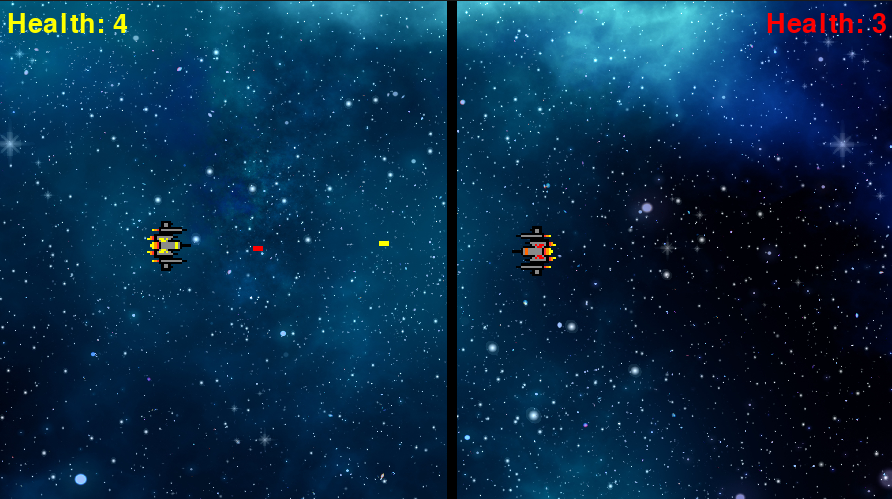

# PYTHON_GAME_SPACEWAR

This is a simple 2D game created using Python with Pygame library.

## Table of Contents

- [Introduction](#introduction)
- [Installation](#installation)
- [Usage](#usage)
- [Instructions](#instructions)
- [Screenshot](#screenshot)

## Introduction

Welcome to Python Game Spacewar! This game is a fun 2D space battle game where you control either the yellow or red ship to fight against each other. It's a great way to spend some time and have some fun!.

## Installation

Before running the game, you need to install the Pygame library. You can install it using pip: pip install pygame.

## Usage

To run the game, you need Visual Studio Code or any other IDE that supports Python. Simply open the project in your IDE, then press the play button to start the game.

Second way is for play is Google Drive link: https://drive.google.com/file/d/1ZE1tuCIBr2ShddQsSS4xpfwIwLLMOy2l/view?usp=sharing

To run the game, you need download from this link, just open exe file and enjoy.

## Instructions

- **Yellow Ship Controls**: Use W, A, S, D keys to move the ship. Press LCTRL to shoot.
- **Red Ship Controls**: Use the UP, DOWN, LEFT, RIGHT arrow keys to move the ship. Press RCTRL to shoot.
- **Restart key**: Use "R".

## Screenshot

